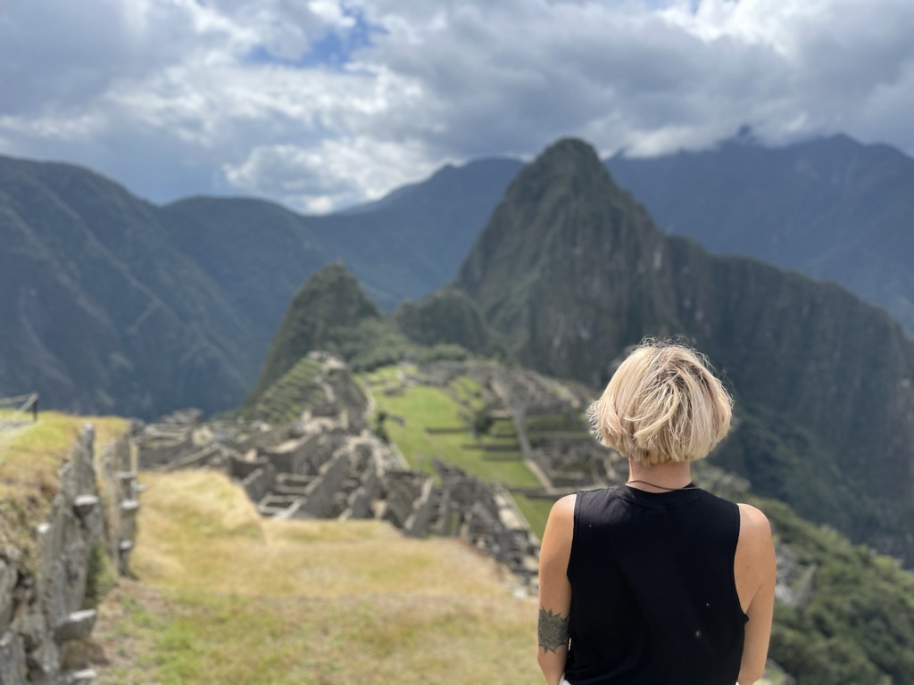

- 9 Länder 
- 49 Wohnungen
- 1 bewaffneter Raubüberfall
- 6 Inseln
- 1 Kofferverlust der Airline
- 7 abgehakte Bucketlist Punkte
- 1 Diebstahl von 3/4 Rucksäcken aus dem Auto
- 1 neue Sprache
- 10.000 weitere Erlebnisse und Erfahrungen

Wie die Zusammenfassung erahnen lässt, waren die zehn Monate ganz schön turbulent - positiv als auch negativ. Diese Gefühlsachterbahn lässt sich meines Erachtens gut mit der einer Beziehung vergleichen.
Du hast die Honeymoon Phase. Dein Date scheint ein wahr gewordener Traum zu sein. Ihr habt eine wunderbare Zeit und du kannst keine Nachteile feststellen. 
Doch irgendwann schlitterst du in die Zweifelphhase. Nervige Angewohnheiten fallen dir langsam auf, ihr geht euch auf den Sack und du fragst dich, ob das alles wirklich Sinn macht, oder ob man noch schnell davon laufen sollte. 
Doch du ziehst durch und gibst dem Ganzen noch eine Chance. Nach einiger Zeit kennt ihr euch wirklich gut, habt gelernt mit den Eigenarten der anderen Person umzugehen und rückt immer näher zusammen. So eng, dass ihr auf einer Welle schwimmt und euch sagt, dass ihr euch liebt. 

Genau so läuft es mit mir und der Reise auch.

Der erste Monat lief rund. Das Aufstehen mitten in der Nacht war ein Klacks, die Möglichkeit, nach der Arbeit in Mexiko ins türkisfarbene Wasser zu springen war noch surreal und neu, das ganze neue Essen war traumhaft. Es war fast zu schön, um wahr zu sein.
Doch wie es in der Anfangszeit so ist, sollte auch bei uns die Honeymoon Phase nicht ewig halten.

Nach Mexiko ging es nach Costa Rica, wo 3 knapp Wochen Urlaub mit Roadtrip auf uns warteten. Bis auf das Auto, das gefühlte 10 PS hatte und uns nicht einmal alle Straßen hochbefördert hat, war alles wunderbar. Dschungel-Trips, Vulkane, gutes Essen. 

Doch dann wurde ich das erste mal aus meiner Blase gerissen: Nach einem 2-Stunden Strandbesuch war der Kofferraum aufgebrochen und 3 von 4 Rucksäcken inkl. Pässe, Arbeitslaptop, iPad, Führerscheinen etc. gestohlen. Glücklicherweise hatten wir unsere Handys und Kreditkarte beim Schwimmen dabei und somit noch Zugang zu Geld. 
Danach folgten zwei Tage Wiederbeschaffung der wichtigsten Teile wie Ladegeräte oder Unterhosen, was kein so großes Problem gewesen wäre, wenn es außerhalb der Hauptstadt Costa Ricas irgendwelche Geschäfte gegeben hätte und wir nicht unsere geplante Route komplett hätten abändern müssen. Aber gut - nachdem der erste Schock verdaut war und wir wieder unsere Handys laden konnten, haben wir den Urlaub noch bis zum Ende genossen. So war die erste aufregende Story immerhin gesichert.

Allerdings kamen die ersten Zweifel auf. Ist die Reise wirklich eine gute Idee? Du willst es lieben, es war anfangs alles so schön. Aber du merkst auch, dass nicht alles so rosig ist, wie es schien.

Die nächste Gelegenheit, an der ich alles anzweifelte, fand zwei Monate später in Kolumbien statt, nachdem wir uns in Kolumbien unheimlich wohl und scheinbar zu sicher gefühlt haben. Manuel wurde mit vorgehaltener Waffe überfallen. Mitten am Tag, auf einer großen und normalerweise belebten Straße gegenüber einer Polizeistation. 

Danach hatte ich überhaupt keinen Bock mehr, muss ich sagen. Das war der Tiefpunkt unserer Reise und ich hätte fast meine Koffer gepackt und wäre zurückgeflogen. Aber ich hielt doch noch länger an meiner Beziehung mit der Reise fest - was eine gute Entscheidung war.

Die Zeit in Ecuador, ein Urlaub auf Galapagos sowie eine Lateinamerika-Pause auf Aruba in den USA hat das Ruder wieder rumgerissen. Ich habe akzeptiert, dass die Sicherheit in Lateinamerika in den meisten Ländern nicht mit der in Deutschland verglichen werden kann, meinen Frieden damit geschlossen, dass ich mich umschauen muss, bevor ich mein iPhone rausholen kann und meine Apple Watch tabu ist. Ich habe wieder zu schätzen gelernt, dass ich diese Reise machen kann und was ich alles erlebe. Es ist alles gut. Ich bin an dem Punkt angekommen, wo die Reise wirklich mein Leben und Alltag ist und ich es liebe.

Jetzt, zehn Monate nach Beginn der Reise und einige Monate ohne böse Überraschungen, hat sich der Alltag eingependelt. Ich komme gut damit klar, nicht jeden Tag irgendetwas erleben zu wollen (was vermutlich auch an einem vergangenen, erlebnisreichen Urlaub und einer eher nicht so aufregenden Stadt liegt).

Ich genieße diese Phase, freue mich aber auch darauf, wieder voller Entdeckungs- und Tatendrang weitere Länder kennenzulernen.