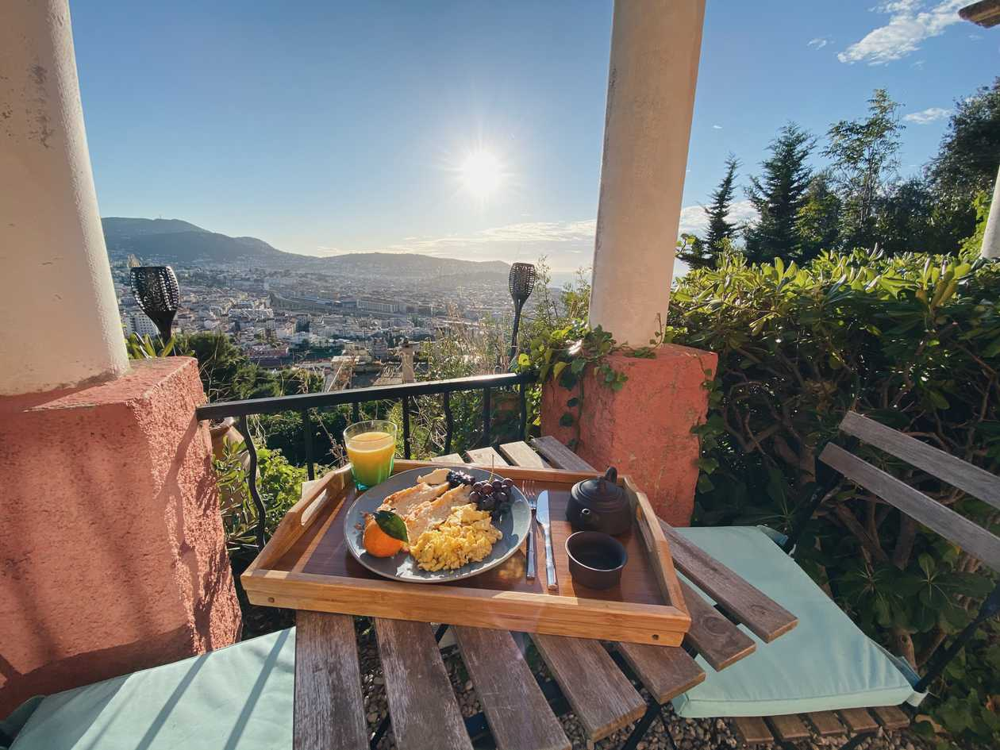

Glücklicherweise verlief die erste full-remote Woche in unserer ersten neuen Wohnung besser als die Fahrt dorthin. Freitagnachmittags ging es im Pott los. In der Nähe der Schweiz begann es zu schütten und zu stürmen. Kurz bevor wir durch einen der vielen Tunnel mussten staute es sich davor. Der Grund: Tunnelsperrung wegen Unwetter. Wir drehen also um und wollen einen Umweg fahren. Doof nur, dass Google uns keinen Umweg nennen wollte. Wir waren aber so klug, den ganzen anderen Leuten hinterherzufahren, die ja bestimmt auch in unsere Richtung wollen. Nach ca. 15 Minuten Fahrt in eine komplett falsche Richtung, ist uns dann bewusst geworden, dass wir Italienern und Briten hinterherfahren, die vermutlich ebenfalls kein Internet dank nicht vorhandenem Roaming hatten. Also wieder zurück und Schweizer fragen, wo wir lang können. Trotz einiger Stunden Fahrt und 4 Uhr nachts, war das eigentlich ganz witzig. Wieder auf der richtigen Strecke, haben wir uns noch nach Italien geschleppt, um Internet zu haben. Auf einem Rastplatz gab es dann ein paar Stündchen Schlaf. Pro-Tipp zum Schlafen, wenn es hell ist: Corona-Maske über die Augen ziehen!

“Gut” erholt ging es weiter nach Frankreich. Abgesehen von der Fahrweise der Franzosen lief alles glatt. Die Unterkunft, welche wir ca. 3 Stunden vorher gebucht hatten (ja, Planung ist bei uns alles!) enttäuschte uns nicht. Eine private Terrasse mit Blick auf ganz Nizza und das Meer inklusive Hängematte sollte unser Lunch-Spot für die Woche sein. Ebenfalls war die Wohnung sehr schön und komfortabel eingerichtet. Es gab sogar zwei Arbeitsplätze, was angesichts des fehlenden zweiten Raums immerhin für etwas mehr Abstand bei gleichzeitigen Telefonaten führte. Generell hatte die Wohnung fast alles, was wir brauchten.

Aber was ist das denn eigentlich, was ich zum vernünftigen remote Arbeiten brauche? Hier sind meine Top 3 (achja - voraussetzung ist natürlich auch ein Computer oder Ähnliches. Wer eine Schreibmaschine oder Block und Stift hat, braucht natürlich auch keinen Strom und ein Internet):

### 1. Tisch und Stuhl

Klingt banal, ist aber so. Wenn ich Leuten erzähle, dass ich mich in der Nähe eines Strandes befinde, ploppen sofort Bilder in deren Köpfe, wie ich Kokosnuss-schlürfend in einer Hängematte liege und von dort aus lässig meine Arbeit verrichte. So funktioniert das (zumindest für mich) leider nicht. Für eine produktive Arbeitsatmosphäre sind ein Tisch und ein halbwegs gemütlicher Stuhl, auf dem es sich auch mal 8 Stunden aushalten lässt, unerlässlich. Wen nicht interessiert, was da eigentlich auf dem Display steht oder wie die KollegInnen aussehen, der kann natürlich auch in der Sonne arbeiten. Ich persönliche bevorzuge indirektes Sonnenlicht, um überhaupt etwas auf meinem Bildschirm erkennen zu können.

### 2. Gutes WLAN

Ist die Verbindung schlecht, kannst du das Arbeiten vergessen. Es ist nicht nur für einen selbst, sondern auch für deine Mitmenschen nervig, wenn dein Bild aussieht als würde es aus etwa 10 Pixeln bestehen. Um smooth zu arbeiten, sollte die Verbindung also schnell und stabil sein. Vorab nach einem Speed-Test zu fragen kann dabei schon helfen. Auch wenn ich die Erfahrung gemacht habe, dass die MB gar nicht unbedingt ausschlaggebend sind. Dennoch sind die ein Indiz dafür, ob überhaupt etwas laden wird, oder nicht.

### 3. Strom

Das mag ebenfalls logisch klingen, ist aber trotzdem nach einer fast einmonatigen Tour mit einem Wohnwagen durch Nordeuropa erwähnenswert. Sorgt für ausreichend Strom, falls ihr autark unterwegs seid. Wir haben uns romantische Arbeitsplätze an Seen und in Wäldern vorgestellt, umringt von nichts als Bäumen und Tieren. Wenn die Sonne dann mal hinterm Baum verschwindet und die Power Station so langsam ihren Geist aufgibt, war es das mit der Vorstellung und man muss in den 30 Minuten, die man zwischen zwei Terminen hat, panisch ein Café suchen, in dem es Internet und Strom gibt, damit man überhaupt weiterarbeiten kann.

Das ist eigentlich auch schon die magische Formel. Verrückt, wie einfach das geht, oder? Was ich sonst noch so brauche, um mich in meinem temporären zu Hause heimisch zu fühlen, erzähl ich euch demnächst.