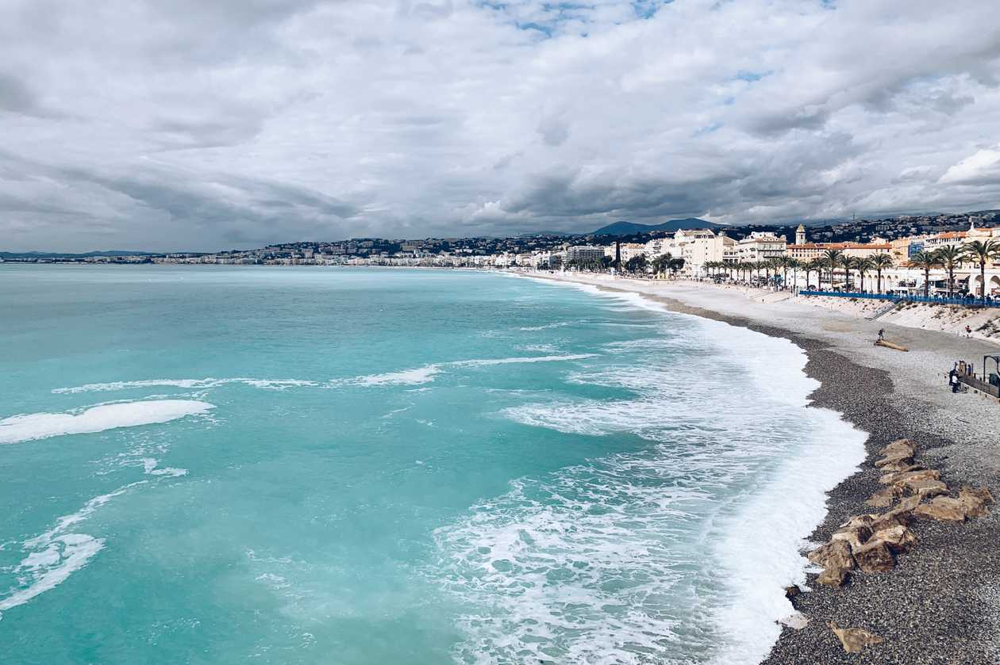

Frankreich sollte unser erstes Ziel sein. Die Côte d’Azur, um genau zu sein. Ob Cannes, Nizza oder sonst was, hat Airbnb für uns entschieden - in Nizza gab es auf die Schnelle eben die beste Wohnung. Die Eingewöhnung ging schnell. Der Sonntag wurde genutzt, um Nizza zu erkunden und dann ging es auch schon los mit der ersten richtigen Arbeitswoche. Es war wie zu Hause. Vielleicht kommt es auch darauf an, wie man gestrickt ist, aber sobald die Wohnung, in der ich mich befinde, meine Kriterien für ein schönes Heim erfüllt und die Gegend nicht total scheiße ist, fühle ich mich zu Hause. Anfangs habe ich in allen Teams-Calls die gleiche Kassette über unsere ersten Tage in Nizza gespielt. Irgendwann war das dann aber auch bei den Kollegen ganz normal und man hat keinen Unterschied zum Home Office in Deutschland gemerkt. Doch ganz so normal war die Woche dann doch nicht.

## Die Balance und der Druck

Ich bin in einem fremden Land, mit Palmen und dem Meer vor der Nase. Alles in mir drin will raus und das Land erkunden. Wandern gehen, Ausflüge machen, das Essen kosten. Doch dafür ist bei einer Vollzeit-Arbeitswoche einfach nicht viel Zeit. Ich bin zugegebenermaßen auch niemand, der schon um 5 Uhr morgens aufsteht, um dann mehr vom Tag zu haben. Auch wenn das in der Hinsicht praktisch wäre. Schon als unser lieber Host uns n2 Orte aufzählte, die wir rund um Nizza besuchen könnten, schwirrte in meinem Kopf nur ein „wann soll ich das alles in der einen Woche machen?!“ rum. Wir spielten mit dem Gedanken, länger dort zu bleiben, gleichzeitig hatten wir aber noch so viel vor und wollten eigentlich schnell weiter nach Spanien und Portugal. So versuchte ich in der ersten Woche so pünktlich wie möglich Feierabend zu machen, um rauszukommen und etwas zu erleben. Unter der Woche blieb nicht allzu viel Zeit für Ausflüge, da es bereits gegen 19 Uhr dunkel wurde. Für 2-3 Stunden lohnt es nicht, weit weg zu fahren. Unsere Pläne, Cannes und St. Tropez unter der Woche zu besuchen, legten wir also ad Acta. Dafür besuchten wir die Sehenswürdigkeiten in Nizza selbst oder flanierten am Meer entlang. An einem Tag machten wir früher Feierabend und fuhren nach Monte Carlo. Dort wurde im Schnelldurchlauf über die Formel-1-Strecke spaziert, die Altstadt besucht, das Casino betrachtet und ein wenig über die eindeutige Werbung der Banken für Reiche geschmunzelt. Positionierung können die aber. Eine Woche später war schon wieder Abreisetag. Wir hatten uns dagegen entschieden, länger zu bleiben, da einfach dieser Druck da war. Wir wollten schnell weiter nach Spanien.

In der ersten Woche war es unheimlich schwierig, den Urlaubsmodus und das Aktivitätslevel in Schach zu halten. Ich hatte durchgehend das Gefühl, zu wenig zu erleben und zu wenig Zeit zu haben, die wichtigsten Orte zu besuchen. Hier ein paar Tipps, um gegen dieses Gefühl anzukommen:

### 1. Du kannst wiederkommen.

Wenn dir ein Ort wirklich gut gefällt und du wirklich das Gefühl hast, dass du nicht genug Zeit hast, aber aktuell auch nicht länger bleiben möchtest, sag dir einfach, dass du wiederkommen kannst. Mit dem Wissen im Hinterkopf, fällt es mir deutlich leichter, weniger zu unternehmen und die ein oder andere Sehenswürdigkeit nicht zu besuchen.

### 2. Du kannst länger bleiben.

Du hast alle Zeit der Welt. Du hast keinen Urlaub und du musst auch nicht zurück nach Hause. DAS ist dein zu Hause. Ich habe etwas gebraucht, bis ich realisiert habe, dass das keine temporäre Reise, sondern mein neues Leben ist. Ich kann mir die Zeit nehmen, die ich brauche, ohne dass die Arbeit oder anderweitige Verpflichtungen zu Hause rufen.

### 3. Du lebst so.

Ich habe häufiger daran gedacht, was ich tun würde, wenn ich nicht-remote in meiner Wohnung „zu Hause in Deutschland“ wäre. Ich würde auch mal nichts machen. Ich würde Nachmittags einfach zu Hause bleiben und eventuell noch zum Einkaufen rausgehen, um mich dann wieder aufs Sofa zu verkriechen. Ich müsste eventuell auch was für minixism erledigen oder Wäsche waschen. Und das ist auch okay so! Mir klar zu machen, dass ich auch normal leben muss, hilft mir, den Druck rauszunehmen.

### 4. Der Weg ist das Ziel.

Ich habe bei Roadtrips prinzipiell das Gefühl, dass der Ort das Ziel ist, der am weitesten entfernt liegt. Alles bis dahin ist die Hinreise, alles von dort weg ist die Rückreise. Doch alles, was ich auf dem Weg erlebe, alle Orte, die ich mitnehme, gehören zur Reise und die sollte ich genießen. Das „schnell weiter Kommen“ stresst unnötigerweise. Das ist der für mich schwierigste Part. Nicht an das zu denken, was kommt, sondern das genießen, wo ich gerade bin.

In den letzten Wochen habe ich mir diese 4 Mantras zu eigen gemacht und ich muss sagen, es fühlt sich mittlerweile ganz normal an. Dazu aber bald mehr!