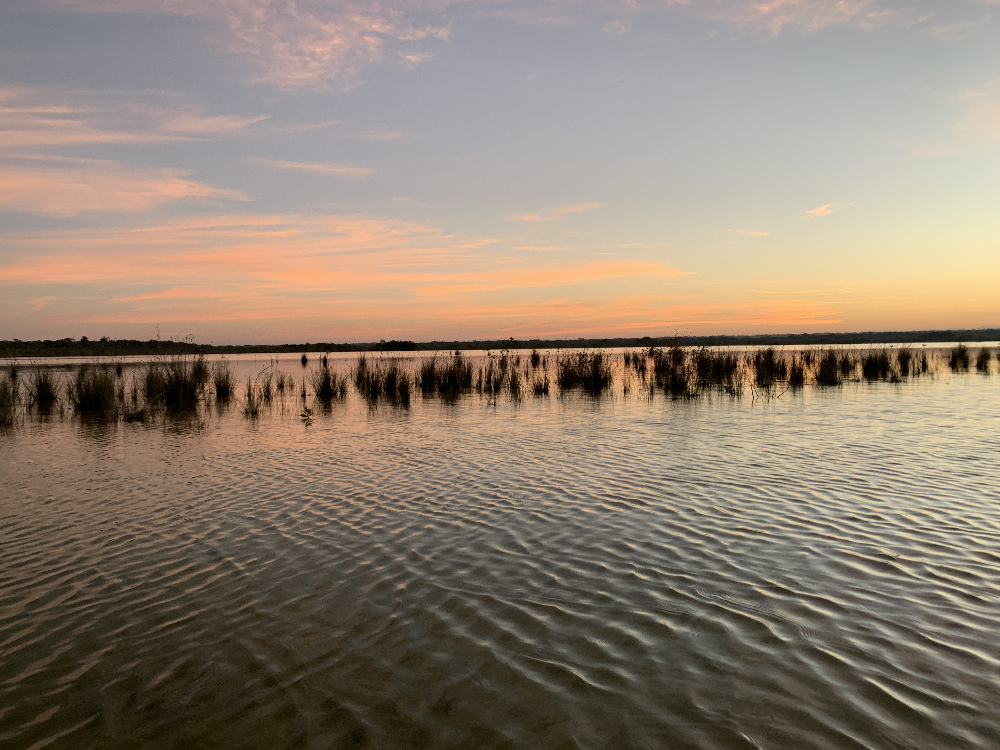
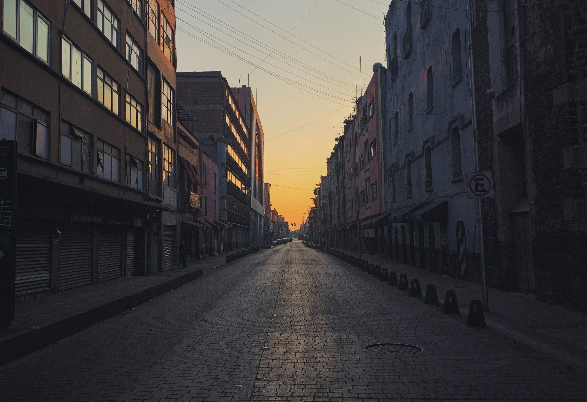

Playa del Carmen schreit mit seiner Touri-Straße, in dem Haufenweise Andenken und kitschige Klamotten gekauft werden können sowie dem türkisfarbenen Meer nur so nach Urlaub. 

Aber für uns gilt natürlich: Erst die Arbeit, dann das Vergnügen. Anfangs haben wir die amerikanischen Digital Nomads beneidet, die so gut wie keine Zeitverschiebung in Mexiko hatten und so zu normalen Zeiten arbeiten können. Doch schon kurze Zeit stellte sich heraus, dass es gar nichts zu beneiden gab.

# Die Arbeit und die Zeitverschiebung
Eine unserer größten Ängste war das Arbeiten mit Zeitverschiebung. In Lateinamerika zu leben, aber in Deutschland zu arbeiten, bringt natürlich ein kleines Abenteuer mit sich.
Mein erster Termin findet täglich um 09:15 Uhr statt. 6 Stunden zurückgerechnet macht das in Playa del Carmen 03:15 Uhr. Und ja, wir sind tatsächlich jeden Tag zwischen 02:45 Uhr und 03:00 Uhr aufgestanden, um pünktlich mit der Arbeit loszulegen. Klingt verrückt, war aber super:

### 1. Besserer Rhythmus
Wer kennt es nicht: Man nimmt sich vor, morgen mal so richtig früh aufzustehen. Doch dann ist das Bett so gemütlich, dass man doch länger liegen bleibt. Wenn andere spätestens um 09:15 Uhr auf einen warten, ist man gezwungen aufzustehen. Andersherum genauso: Wenn du weißt, dass du um 03:00 Uhr aufstehen musst, gehst du allerspätestens um 18 Uhr ins Bett. So habe innerhalb der ersten zwei Wochen in Mexiko einen sehr festen Schlafrhythmus aufgebaut. Okay, am Wochenende habe ich mal die Sau rausgelassen und bis 05:00 Uhr geschlafen, aber dafür ist ein Wochenende ja da!
### 2. Weniger Zeitverschwendung am Handy
Mein erster Griff morgens nach dem Aufwachen galt meinem Handy. Erstmal eine Runde Nachrichten lesen, durch Instagram scrollen und so sinnlos die Zeit verschwenden. Wenn ich um 03:00 Uhr aufstehen muss, stell ich mir keinen Wecker um 02:00 Uhr, nur um eine Stunde im Bett rumzuliegen und nichts zu machen. Die Zeitumstellung war pure Zeitoptimierung.
### 3. Aktivere Nutzung der freien Zeit
In Deutschland habe ich, besonders im Herbst und Winter, wenn die Tage kürzer werden, ab spätestens 20:00 Uhr auf der Couch gesessen und Netflix geguckt oder sonstige unproduktive Dinge getan. Wenn du weißt, dass du zwischen 17:00 und 18:00 Uhr so langsam schlafen gehen solltest, legst du dich nicht um 14:00 Uhr hin, um noch ein bisschen Netflix zu schauen. Insbesondere nicht, wenn draußen die Sonne scheint!
### 4. Feierabend um 11:00 Uhr
Den werde ich vermissen, wenn ich irgendwann wieder mit weniger Zeitverschiebung lebe. Es ist ein tolles Gefühl, wenn du nach 8 Stunden Büro-Job noch fast den ganzen Tag vor dir hast. In Playa del Carmen ging gegen 18 Uhr die Sonne unter. So hatten wir unsere gesamte wache Zeit über Tageslicht. Durch die Einsparung aus Punkt 2 und 3 blieben uns so täglich um die 5 Stunden, um was zu erleben. In Deutschland habe ich mich Abends gefragt, wo eigentlich der Tag geblieben ist.

Insgesamt kann ich sagen, dass die Angst vor der Zeitverschiebung vollkommen unbegründet war. Sich daran zu gewöhnen war entgegen mancher Vermutung auch nicht schwer. Statt Jetlag, den wir normalerweise gehabt hätten, sind wir in deutscher Zeit geblieben.

Natürlich hatte ich Tage, an denen ich auch gerne mal länger liegen geblieben wäre, aber die habe ich auch in Deutschland. Es gibt auch negative Seiten. Es gab beispielsweise eine Art Night Market, der zu unserer Schlafenszeit gerade mal aufgebaut wurde. Glücklicherweise hat der dazugehörige Churros-Verkäufer aber schon früher aufgemacht, sodass ich eben ohne Markt, dafür aber mit Churros im Bauch einschlafen konnte. Ausgehen und Clubs habe ich ebenfalls nicht vermisst. In Deutschland war ich eh schon eine Couch Potatoe und habe keine besucht, da muss ich auch in Mexiko - schon gar nicht während Corona - durch keine Clubs tingeln. Ansonsten fällt mir nichts ein, was ich durchs frühe Schlafengehen verpasst haben könnte.

In diesem Sinne: Ein Hoch auf die Zeitverschiebung!

Übrigens: die eine Stunde mehr in Mexiko City hatte keine Auswirkungen auf unseren Rhythmus. Es bleibt spannend, wie sich der Urlaub, in dem wir das frühe Aufstehen etwas haben schleifen lassen, bemerkbar macht, wenn wir wieder arbeiten müssen.